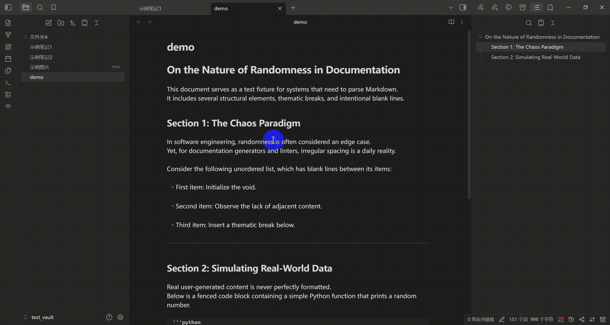

# Obsidian Delete Empty Lines

用于删除或压缩笔记中的空行，支持处理整篇文档或仅处理选中内容。

[English](./README.md)

## 演示



## 功能

- 处理全文空行
- 仅处理选中区域
- 可配置最大连续空行数
- 可选是否将“仅空格/制表符”的行视为空行
- 国际化界面（`English` 与 `简体中文`）

## 命令

- 压缩空行（全文，保留 {count} 行）
- 压缩空行（选中区域，保留 {count} 行）

命令中的 `{count}` 会根据设置动态更新。

## 右键菜单

- 有选中文本时：显示选中区域处理命令
- 未选中文本时：显示全文处理命令


## 安装

### 使用 BRAT 安装（推荐）

1. 从社区插件安装 [BRAT](https://github.com/TfTHacker/obsidian42-brat) 插件。
2. 打开 BRAT 设置，在 `Beta plugin list` 点击 `Add Beta plugin`，在 `Repository` 中并添加此仓库：
`kqint/obsidian-delete-empty-lines`，选择 Latest version 安装。
3. 在社区插件中启用本插件。
4. 更新将自动安装。

### 手动安装

1. 在 [releases/latest](https://github.com/kqint/obsidian-delete-empty-lines/releases/latest) 下载 `main.js` 和 `manifest.json`。
2. 将 `main.js` 和 `manifest.json` 复制到：
   `.obsidian/plugins/delete-empty-lines/`
3. 重启 Obsidian，并在社区插件中启用本插件。


## 国际化

语言源文件位于 `locales/`：

- `locales/en.json`
- `locales/zh-CN.json`

使用以下命令可将这些语言文件打包进 `main.js`：

```bash
npm run build
```

如需新增语言：

1. 复制 `locales/en.json`，例如为 `locales/ja.json`。
2. 翻译其中所有值。
3. 在 `src/main.ts` 中加入对应语言选项并执行 `npm run build`。


## 许可证

[MIT](./LICENSE)
